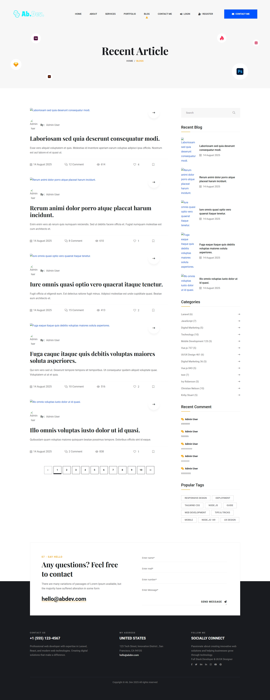

# Portfolio Website with Laravel

A modern, feature-rich portfolio website built with Laravel 11, designed for developers and creative professionals to showcase their work, skills, and expertise.

## 🚀 Features

### Frontend Features

-   **Responsive Design**: Built with Tailwind CSS and Alpine.js for a modern, mobile-first experience
-   **Portfolio Showcase**: Display projects with detailed information, categories, and images
-   **About Section**: Comprehensive about page with skills, education, awards, and experience
-   **Services**: Showcase services offered with detailed descriptions
-   **Blog System**: Full-featured blog with categories, tags, comments, and interactions
-   **Contact Form**: Interactive contact form with admin notifications
-   **Interactive Elements**: Like/bookmark functionality for blog posts and comments

### Admin Panel Features

-   **Dashboard**: Comprehensive admin dashboard with statistics and management tools
-   **Content Management**:
    -   Portfolio projects management
    -   Blog posts with rich text editor
    -   Services management
    -   Skills and education management
    -   Testimonials and partners management
    -   Awards and achievements tracking
-   **User Management**: User roles (Admin/User) with status controls
-   **Contact Management**: View and respond to contact form submissions
-   **SEO-Friendly**: Slug-based URLs and meta descriptions
-   **Image Management**: Integrated image upload and management system

### Technical Features

-   **Authentication**: Laravel Breeze with email verification
-   **Notifications**: Real-time notifications for admin activities
-   **Email System**: Contact form emails and admin reply system
-   **Database**: Well-structured database with relationships
-   **Testing**: PHPUnit and Pest testing framework setup
-   **File Storage**: Image upload and storage management
-   **Policies**: Authorization policies for content management

## 🛠️ Technology Stack

-   **Backend**: Laravel 11 (PHP 8.2+)
-   **Frontend**: Blade Templates, Tailwind CSS, Alpine.js
-   **Database**: MySQL/SQLite
-   **Build Tools**: Vite
-   **Image Processing**: Intervention Image
-   **Testing**: PHPUnit, Pest
-   **Authentication**: Laravel Breeze

## � Screenshots

### Frontend Views

<table>
  <tr>
    <td align="center">
      
      <br><strong>Home Page</strong>
    </td>
    <td align="center">
      
      <br><strong>About Page</strong>
    </td>
  </tr>
  <tr>
    <td align="center">
      
      <br><strong>Portfolio Page</strong>
    </td>
    <td align="center">
      
      <br><strong>Services Page</strong>
    </td>
  </tr>
  <tr>
    <td align="center">
      
      <br><strong>Blog Page</strong>
    </td>
    <td align="center">
      
      <br><strong>Blog Details</strong>
    </td>
  </tr>
  <tr>
    <td align="center">
      
      <br><strong>Contact Page</strong>
    </td>
    <td align="center"></td>
  </tr>
</table>

### Admin Panel

<table>
  <tr>
    <td align="center">
      
      <br><strong>Admin Dashboard</strong>
    </td>
    <td align="center">
      
      <br><strong>User Dashboard</strong>
    </td>
  </tr>
  <tr>
    <td align="center">
      
      <br><strong>Blog Management</strong>
    </td>
    <td align="center">
      
      <br><strong>Create Blog Post</strong>
    </td>
  </tr>
  <tr>
    <td align="center">
      
      <br><strong>User Management</strong>
    </td>
    <td align="center">
      
      <br><strong>Contact Messages</strong>
    </td>
  </tr>
  <tr>
    <td align="center">
      
      <br><strong>About Information</strong>
    </td>
    <td align="center">
      
      <br><strong>Home Slide Management</strong>
    </td>
  </tr>
  <tr>
    <td align="center">
      
      <br><strong>Services Management</strong>
    </td>
    <td align="center">
      
      <br><strong>Testimonials</strong>
    </td>
  </tr>
  <tr>
    <td align="center">
      
      <br><strong>Partners Management</strong>
    </td>
    <td align="center">
      
      <br><strong>Technology Management</strong>
    </td>
  </tr>
  <tr>
    <td align="center">
      
      <br><strong>Comments Management</strong>
    </td>
    <td align="center">
      
      <br><strong>Like Management</strong>
    </td>
  </tr>
  <tr>
    <td align="center">
      
      <br><strong>Website Information</strong>
    </td>
    <td align="center"></td>
  </tr>
</table>

## �📋 Requirements

-   PHP 8.2 or higher
-   Composer
-   Node.js & npm
-   MySQL or SQLite database
-   Web server (Apache/Nginx) or Laravel Valet/Sail

## ⚡ Quick Installation

1. **Clone the repository**

    ```bash
    git clone https://github.com/babdellghani/Portfolio-With-Laravel.git
    cd Portfolio-With-Laravel
    ```

2. **Install PHP dependencies**

    ```bash
    composer install
    ```

3. **Install JavaScript dependencies**

    ```bash
    npm install
    ```

4. **Environment setup**

    ```bash
    cp .env.example .env
    php artisan key:generate
    ```

5. **Configure database**
   Update your `.env` file with database credentials:

    ```env
    DB_CONNECTION=mysql
    DB_HOST=127.0.0.1
    DB_PORT=3306
    DB_DATABASE=your_database_name
    DB_USERNAME=your_username
    DB_PASSWORD=your_password
    ```

6. **Run migrations and seeders**

    ```bash
    php artisan migrate
    php artisan db:seed
    ```

7. **Create storage link**

    ```bash
    php artisan storage:link
    ```

8. **Build assets**

    ```bash
    npm run build
    # or for development
    npm run dev
    ```

9. **Start the development server**
    ```bash
    php artisan serve
    ```

Visit `http://localhost:8000` to see your portfolio website!

## 🗂️ Project Structure

```
app/
├── Http/Controllers/
│   ├── Admin/           # Admin panel controllers
│   ├── About/           # About page controllers
│   └── Home/            # Frontend controllers
├── Models/              # Eloquent models
├── Notifications/       # Laravel notifications
├── Policies/           # Authorization policies
└── Mail/               # Mail classes

resources/
├── views/
│   ├── admin/          # Admin panel views
│   ├── frontend/       # Frontend views
│   └── layouts/        # Layout templates
├── css/                # Stylesheets
└── js/                 # JavaScript files

database/
├── migrations/         # Database migrations
├── seeders/           # Database seeders
└── factories/         # Model factories
```

## 🎨 Key Models

-   **User**: Authentication with roles (Admin/User)
-   **Portfolio**: Project showcase with categories
-   **Blog**: Blog posts with categories and tags
-   **Service**: Services offered
-   **About**: About page content
-   **Skill**: Technical skills
-   **Education**: Educational background
-   **Award**: Awards and achievements
-   **Testimonial**: Client testimonials
-   **Contact**: Contact form submissions

## 🔧 Configuration

### Admin Access

Create an admin user:

```bash
php artisan tinker
```

```php
$user = User::create([
    'name' => 'Admin User',
    'email' => 'admin@example.com',
    'password' => Hash::make('password'),
    'role' => 'admin',
    'status' => 1
]);
```

### Email Configuration

Configure your email settings in `.env`:

```env
MAIL_MAILER=smtp
MAIL_HOST=your-smtp-host
MAIL_PORT=587
MAIL_USERNAME=your-email
MAIL_PASSWORD=your-password
MAIL_ENCRYPTION=tls
MAIL_FROM_ADDRESS=your-email
MAIL_FROM_NAME="${APP_NAME}"
```

## 🚀 Deployment

1. **Production environment**

    ```bash
    composer install --optimize-autoloader --no-dev
    npm run build
    php artisan config:cache
    php artisan route:cache
    php artisan view:cache
    ```

2. **Set proper permissions**

    ```bash
    chmod -R 755 storage bootstrap/cache
    ```

3. **Configure web server**
   Point your domain to the `public` directory

## 🤝 Contributing

1. Fork the repository
2. Create your feature branch (`git checkout -b feature/amazing-feature`)
3. Commit your changes (`git commit -m 'Add some amazing feature'`)
4. Push to the branch (`git push origin feature/amazing-feature`)
5. Open a Pull Request

## 📝 License

This project is open-sourced software licensed under the [MIT license](https://opensource.org/licenses/MIT).

## 📞 Support

If you encounter any issues or have questions, please open an issue on the GitHub repository.
